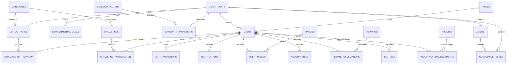

# EcoSphere Database ER Diagram

```mermaid
erDiagram

ROLES ||--o{ USERS : assigns
DEPARTMENTS ||--o{ USERS : contains

DEPARTMENTS ||--o{ ENVIRONMENTAL_GOALS : owns
DEPARTMENTS ||--o{ CSR_ACTIVITIES : organizes
DEPARTMENTS ||--o{ CARBON_TRANSACTIONS : generates
DEPARTMENTS ||--o{ AUDITS : conducts
DEPARTMENTS ||--o{ COMPLIANCE_ISSUES : contains

CATEGORIES ||--o{ CSR_ACTIVITIES : categorizes
CATEGORIES ||--o{ CHALLENGES : categorizes

EMISSION_FACTORS ||--o{ CARBON_TRANSACTIONS : calculates

USERS ||--o{ EMPLOYEE_PARTICIPATION : participates
CSR_ACTIVITIES ||--o{ EMPLOYEE_PARTICIPATION : includes

USERS ||--o{ CHALLENGE_PARTICIPATION : joins
CHALLENGES ||--o{ CHALLENGE_PARTICIPATION : contains

USERS ||--o{ XP_TRANSACTIONS : earns

BADGES ||--o{ USER_BADGES : awards
USERS ||--o{ USER_BADGES : receives

REWARDS ||--o{ REWARD_REDEMPTIONS : redeemed
USERS ||--o{ REWARD_REDEMPTIONS : redeems

POLICIES ||--o{ POLICY_ACKNOWLEDGEMENTS : acknowledged
USERS ||--o{ POLICY_ACKNOWLEDGEMENTS : acknowledges

AUDITS ||--o{ COMPLIANCE_ISSUES : identifies

USERS ||--o{ NOTIFICATIONS : receives

USERS ||--o{ ACTIVITY_LOGS : performs

USERS ||--o{ SETTINGS : updates
```